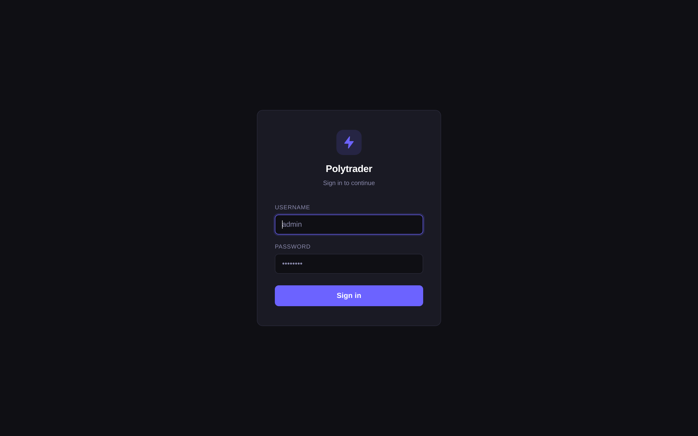

<div align="center">

# ⚡ Polytrader

### An automated, quant-grade trading framework for Polymarket crypto markets

*Built in Rust · Live on Polymarket · Trading BTC / ETH / SOL / XRP up-or-down series*

</div>

---

## What it is

**Polytrader** is a complete, reusable trading framework for Polymarket's short-horizon crypto
**"up-or-down"** events (5-minute, 15-minute, hourly). It covers the full lifecycle of an
automated strategy — from gathering live market data, to computing trading signals, to executing
paper and live trades — with the shared risk and execution machinery a quant desk would build,
pointed entirely at Polymarket.

It is not a script. It's a Rust workspace with a live execution engine, a deterministic
recording-and-replay backtester, a parameter optimizer, and a mobile + web control panel.

## What it delivers

- 🧩 **A reusable, strategy-agnostic framework**, not a one-off bot — new strategies plug into the
  same data, execution, and risk layers (eight are already implemented).
- 🔁 **Record → replay → optimize** — the same strategy code runs live, replays recorded sessions
  tick-for-tick, and feeds a parameter optimizer, so what you backtest is exactly what you trade.
- 🤝 **Native Polymarket integration** — trades the Polymarket CLOB directly and redeems settled
  positions through the **Builder relayer**, built around Polymarket's own event series and API.
- 📈 **Continuous automated flow** on the crypto up-or-down series as a by-product of running
  signal-driven strategies around the clock.

A builders grant lets us harden and extend this framework — more strategies, more series, higher uptime.

---

## See it running

> Real captures from the live control panel — nine strategy books across **all four assets and
> both pricing models**, plus a **live Polymarket account** trading alongside paper books.


*Every strategy book at a glance: live balances, unrealised P&L, open positions, and running-bot health.*

| Account detail | Multi-asset strategy monitor |
|---|---|
|  |  |
| P&L history chart, open positions, and a full transaction log (buys / redemptions) — here on a live BTC 15m book. | One bot orchestrating BTC/ETH/SOL/XRP across two strategies, with per-strategy live P&L. |

| Mobile app | Secure login |
|---|---|
|  |  |
| Ships as an Android app (APK) — monitor every book from anywhere. | Argon2-hashed credentials with session auth. |

---

## The framework

Polytrader is built in layers. A strategy is just the thin signal layer on top — everything below
it is shared, tested infrastructure that every strategy reuses.

### 📡 Live market-data gathering
A unified data layer collects and caches everything a strategy needs in real time: Polymarket CLOB
order books (push-based WebSocket), crypto spot prices (RTDS / Binance), 1-minute klines, and
per-event strike tracking — all behind one `MarketDataProvider` abstraction.

### 🧮 Trading-signal calculation
Strategies consume that data to compute entry/exit signals — option-pricing fair value, spot-vs-strike
momentum, order-book imbalance, arbitrage edges, and more. The layer is **strategy-agnostic**: signals
are pure functions of market data, so they behave identically live and in replay. *(Eight strategies
are implemented today; adding another is a focused, isolated change.)*

### ⚙️ Paper & live execution
One execution path runs against either an **in-memory / paper wallet** or the **live Polymarket CLOB**
— same code, same accounting, selected by config. Orders are GTD with server-side expiry (a crashed
bot's orders die on their own), and settled positions are redeemed through the Builder relayer.

### 🛡️ Shared core components
Reused across every strategy: **stop-loss** and **adaptive trailing stops**, risk-based position
sizing, an API **circuit breaker**, NaN/∞ order guards, and exchange-minimum clamping.

---

## Telegram bot — monitor *and* manage from your phone

Telegram is a full **interactive control surface**, not just a notification feed. A `/start` menu
exposes inline commands to query live state on demand, and every running strategy pushes real-time
alerts as it acts — so an operator can supervise a fleet of bots entirely from chat.

**Query & manage** — `/positions`, `/orders`, `/trades` (and the menu buttons) return live data
with **inline navigation**: per-position **Details**, a **Refresh** button that re-pulls the latest
state in place, and **Back**. Positions show purchase vs. current value and price, USDC balance,
and total exposure; trades show buys, sells, and on-chain **redemptions** with outcomes and dates.

**Live alerts** — each strategy streams `🚀 init`, `✅ buy/sell executed` (with quantity, price,
trend), redemptions, and `🚨 termination` events as they happen, tagged by strategy and market.

| Command menu | Live positions | Trades & redemptions | Real-time alerts |
|---|---|---|---|
|  |  |  |  |

---

## Recording, replay & optimization

This is the backbone that makes the framework trustworthy — and the part a grant would most help us extend.

- **Recording.** While trading live, every tick is captured to a compact, deduplicated
  `rkyv + zstd` session — full order books, spot prices, klines, time-to-maturity, strike, and the
  strategy's own decisions. Sessions chunk automatically and survive data outages, building a
  growing, replayable history of real market conditions.

- **Replay.** Recorded sessions are replayed **tick-for-tick** through the *same*
  `MarketDataProvider` trait the live engine uses. There is no separate backtest code path, so a
  strategy cannot behave differently in test than in production — the single biggest source of
  backtest/live divergence is eliminated by construction.

- **Optimization.** A Particle-Swarm and grid optimizer searches strategy parameters over recorded
  sessions, with:
  - **Overfitting resistance** — explicit validation / test splits and per-hour reporting, so a
    parameter set has to generalise, not just fit one window.
  - **Risk-adjusted objectives** — optimise for Sharpe / Sortino / Calmar with max-drawdown
    constraints, not just raw profit.
  - **Speed** — an in-memory wallet bypasses the database on the hot path for a **~8× speedup**, with
    parallel session loading across cores, making large sweeps practical.

Together these turn "I think this strategy works" into "this parameter set was validated on real
recorded Polymarket data and is the exact code now trading live."

---

## Architecture

```
┌─────────────────────────────────────────────────────────────┐
│                     Polytrader workspace (Rust)              │
├───────────────┬───────────────┬───────────────┬─────────────┤
│ trading_bot   │ optimizer      │ core_services │ web_ui      │
│ strategies +  │ PSO / grid +   │ market data,  │ Flutter +   │
│ live engine   │ replay engine  │ CLOB, wallets │ Axum API    │
└───────┬───────┴───────┬────────┴───────┬───────┴─────────────┘
        │               │                │
        └──── MarketDataProvider trait ──┘   ← one abstraction,
              live feed  ⇆  deterministic replay   two implementations
                              │
                  poly-clob-rs  →  Polymarket CLOB + Builder relayer
                  RTDS / Binance →  real-time crypto spot
```

**Stack:** Rust (async / Tokio), PostgreSQL + Diesel, Axum, Flutter, `poly-clob-rs` (Polymarket
CLOB client), `rkyv` / `zstd` (replay), Argon2 (auth).

---

## Roadmap — what a grant unlocks

- **Breadth:** run the framework across the full BTC / ETH / SOL / XRP × 5m / 15m / hourly grid.
- **Uptime:** hardened deployment + a live loss kill-switch so strategies run continuously and safely.
- **Research:** deeper replay tooling and a larger optimization harness on top of the recording pipeline.
- **Openness:** publish the replay format and optimizer harness as reusable tooling for the
  Polymarket builder community.

---

<div align="center">

**Polytrader** — bringing quant-desk infrastructure to Polymarket's crypto markets.

📧 FlorentG74@proton.me

</div>
