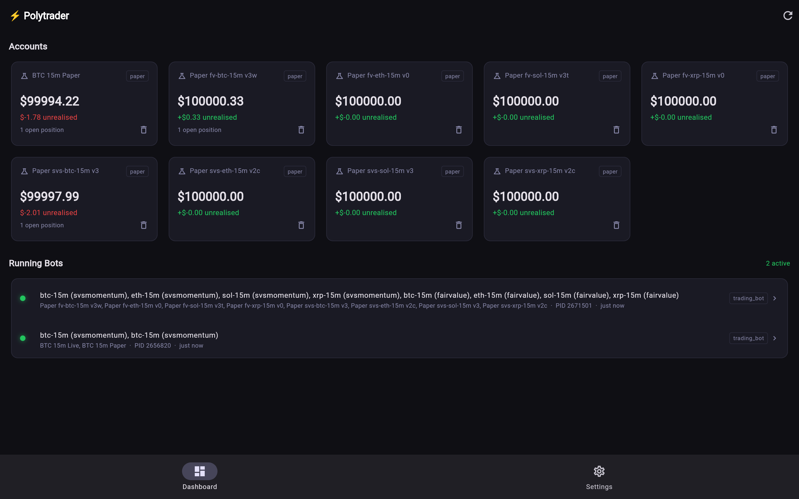
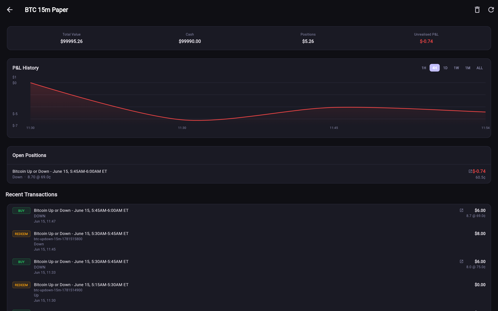
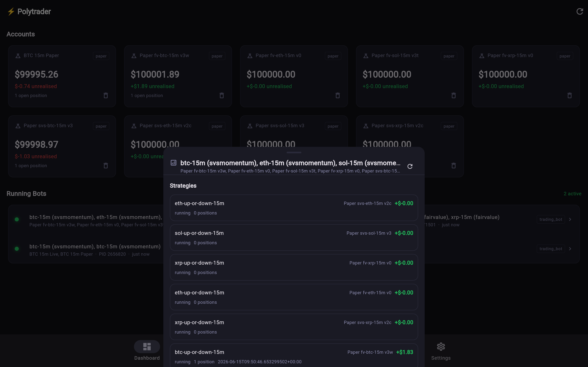
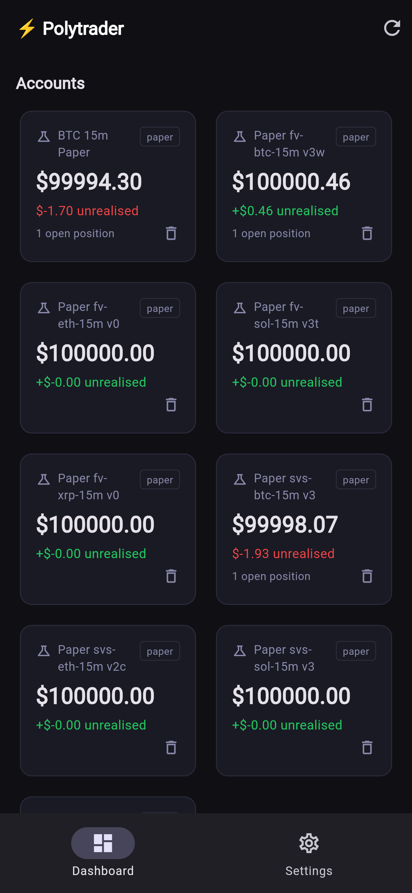
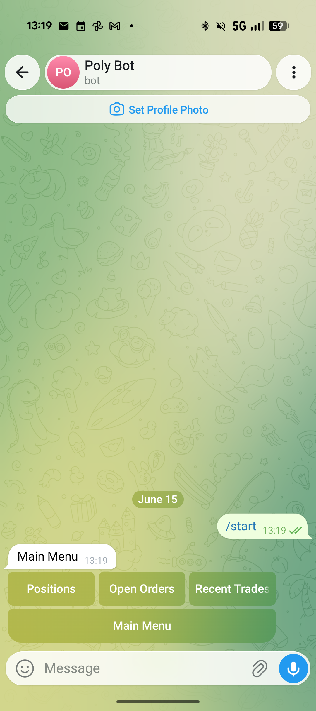
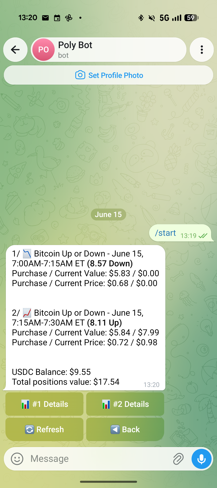
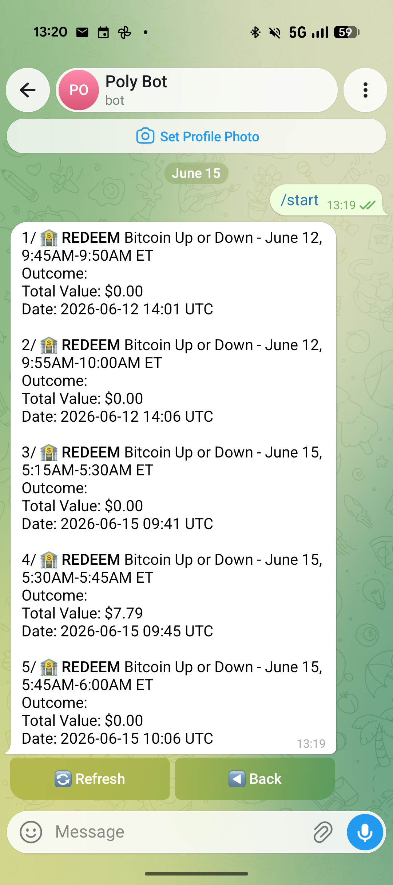
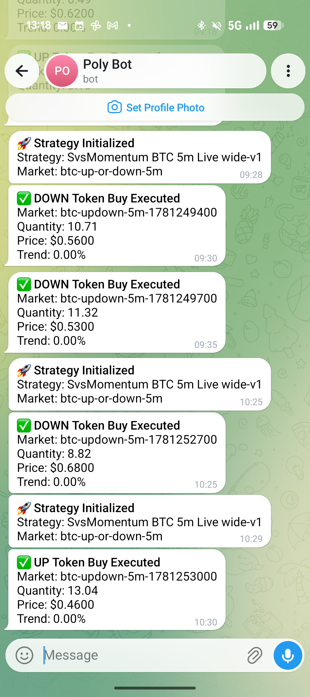

<div align="center">

# ⚡ Polytrader

### An automated, quant-grade trading framework for Polymarket crypto markets

*Built in Rust · Live on Polymarket · Trading BTC / ETH / SOL / XRP up-or-down series*

</div>

---

## What it is

**Polytrader** is a complete, reusable trading framework for Polymarket, currently supporting short-horizon crypto
**"up-or-down"** events (5-minute, 15-minute, hourly). It covers the full lifecycle of an
automated strategy (from gathering live market data, to computing trading signals, to executing
paper and live trades) with the shared risk and execution machinery a quant desk would build,
pointed entirely at Polymarket.

It's a complete system: a live execution engine, a deterministic
recording-and-replay backtester, a parameter optimizer, and a mobile + web control panel.

## What it delivers

- 🧩 **A reusable, strategy-agnostic framework**, where new strategies plug into the
  same data, execution, and risk layers (eight are already implemented).
- 🔁 **Record → replay → optimize**: the same strategy code runs live, replays recorded sessions
  tick-for-tick, and feeds a parameter optimizer, so what you backtest is exactly what you trade.
- 🤝 **Native Polymarket integration** trades directly on Polymarket and automatically claims
  settled winnings, built around Polymarket's own crypto event series.
- 📈 **Continuous automated flow** on the crypto up-or-down series as a by-product of running
  signal-driven strategies around the clock.

**Why a grant, and what Polymarket gets back.** The system already runs privately; a builders grant
would fund turning this battle-tested infrastructure into **shared public tooling** for the Polymarket
builder community; open-sourcing the framework and making it usable by other traders, which brings
more builders, more automated flow, and more liquidity onto Polymarket's crypto series. The live
trading system is the proof that the infrastructure works; the funded deliverable is the public good
(see the [roadmap](#roadmap--what-a-grant-unlocks)).

---

## See it running

> Real captures from the live control panel: nine running strategy *books* (instances of the eight
> implemented strategies) across **all four assets and both pricing models**, plus a **live Polymarket
> account** trading alongside paper books.


*Every strategy book at a glance: live balances, unrealised P&L, open positions, and running-bot health.*

| Account detail | Multi-asset strategy monitor |
|---|---|
|  |  |
| P&L history chart, open positions, and a full transaction log (buys / redemptions), here on a live BTC 15m book. | One bot orchestrating BTC/ETH/SOL/XRP across two strategies, with per-strategy live P&L. |

| Mobile app |
|---|
|  |
| Ships as a mobile app, monitor every book from anywhere. |

---

## The framework

Polytrader is built in layers. A strategy is just the thin signal layer on top; everything below
it is shared, tested infrastructure that every strategy reuses.

### 📡 Live market-data gathering
A unified data layer continuously collects and caches everything a strategy needs in real time:
live order books, crypto spot prices, recent price history, and each event's strike, all behind
one clean interface, so strategies never deal with raw feeds.

### 🧮 Trading-signal calculation
Strategies turn that data into entry/exit signals: fair-value option pricing, price-vs-strike
momentum, order-book imbalance, arbitrage edges, and more. The layer is **strategy-agnostic** and
its signals are derived purely from market data, so they behave identically live and in replay.
*(Eight strategies are implemented today; adding another is a focused, isolated change.)*

### ⚙️ Paper & live execution
One execution path runs against either a **paper account** or a **live Polymarket account**; same
code, same accounting, chosen by a single config switch. Live orders carry a built-in expiry so a
crashed bot leaves nothing dangling, and settled positions are redeemed automatically.

### 🛡️ Shared core components
Reused across every strategy: **stop-loss** and **adaptive trailing stops**, risk-based position
sizing, automatic recovery from data/connectivity hiccups, and order-placement guardrails (e.g. a
NaN-price guard, an exchange-minimum size clamp, a circuit breaker) that block malformed or
too-small orders before they reach the market.

---

## Telegram bot: monitor *and* manage from your phone

Telegram is a full **interactive control surface**, not just a notification feed. A `/start` menu
exposes inline commands to query live state on demand, and every running strategy pushes real-time
alerts as it acts, so an operator can supervise a fleet of bots entirely from chat.

**Query & manage**: `/positions`, `/orders`, `/trades` (and the menu buttons) return live data
with **inline navigation**: per-position **Details**, a **Refresh** button that re-pulls the latest
state in place, and **Back**. Positions show purchase vs. current value and price, USDC balance,
and total exposure; trades show buys, sells, and on-chain **redemptions** with outcomes and dates.

**Live alerts**: each strategy streams `🚀 init`, `✅ buy/sell executed` (with quantity, price,
trend), redemptions, and `🚨 termination` events as they happen, tagged by strategy and market.

| Command menu | Live positions | Trades & redemptions | Real-time alerts |
|---|---|---|---|
|  |  |  |  |

---

## Recording, replay & optimization

This is the backbone that makes the framework trustworthy.

- **Recording.** While trading live, every market tick is captured to a compact recording: full
  order books, spot prices, recent price history, timing, strike, and the strategy's own decisions.
  Recordings roll over automatically and survive data outages, building a growing, replayable
  history of real market conditions.

- **Replay.** Recorded sessions are replayed **tick-for-tick** through the *exact same code path*
  the live engine uses. There is no separate backtest code, so a strategy cannot behave differently
  in test than in production; the single biggest source of backtest/live divergence is eliminated
  by design.

- **Optimization.** An optimizer automatically searches strategy parameters over recorded data, with:
  - **Overfitting resistance**: separate validation and test windows (and per-hour reporting), so a
    parameter set has to generalise, not just fit one period.
  - **Risk-adjusted objectives**: tune for risk-adjusted return and drawdown limits, not just raw profit.
  - **Raw Speed**: strategy P&L is evaluated against an in-memory portfolio that runs about **8× faster
    than the database-backed path**, making large parameter sweeps practical.

Together these turn "I think this strategy works" into "this parameter set was validated on real
recorded Polymarket data and is the exact code now trading live."

---

## How it fits together

```
        ┌────────────────────────────────────────────────┐
        │   Control panel (web + mobile)  ·  Telegram bot │   monitor & manage
        └───────────────────────┬────────────────────────┘
                                 │
   ┌──────────────┬─────────────┴──────────────┬───────────────────┐
   │  Strategies  │   Recording · replay ·      │  Paper & live     │
   │  (signals)   │   optimization              │  execution        │
   └──────────────┴─────────────┬──────────────┴───────────────────┘
                                 │
                 ┌───────────────┴────────────────┐
                 │     Unified market-data layer   │   one feed →
                 │   live trading  OR  replay      │   same strategy code
                 └───────────────┬────────────────┘
                                 │
                Polymarket markets  +  real-time crypto prices
```

The key design choice: one market-data layer feeds the *same* strategy code whether it's trading
live or replaying history; what you research is exactly what you trade.

---

## Roadmap: what a grant unlocks

The grant deliverables are ordered so the **public-good work comes first**. The private trading
system already exists; the milestones below are about making it useful to the wider Polymarket
builder community.

- **Milestone 1: Open the infrastructure.** Publish the data, execution, risk, and record/replay
  layers as an open-source set of reusable tooling for Polymarket builders, with documentation and
  example strategies. *What Polymarket gets:* a maintained, public framework other builders can build
  bots on.
- **Milestone 2: Multi-tenant service.** Today each part of the platform manages a single
  account/bot at a time. The whole stack (dashboard, mobile and Telegram control, recording, and the
  optimization tooling) becomes a hosted, multi-tenant service so other traders can run, monitor, and
  optimize their own bots from one place. *What Polymarket gets:* more independent builders running
  automated flow on the crypto series.
- **Milestone 3: New market types.** Only crypto up/down markets are fully supported today; the same
  data → signal → execution → risk pipeline can be extended to other Polymarket markets driven by
  external insight feeds (news, data, sentiment). *What Polymarket gets:* automated flow beyond the
  crypto series.
- **Ongoing: Research.** Deeper replay tooling and a larger optimization harness on top of the
  recording pipeline.

*Use of funds and timeline:* the grant would be scoped to the milestones above; the specific amount,
tranches, and delivery dates are to be agreed with the committee.

---

<div align="center">

**Polytrader** - bringing quant-desk infrastructure to Polymarket's crypto markets.

📧 FlorentG74@proton.me

</div>
