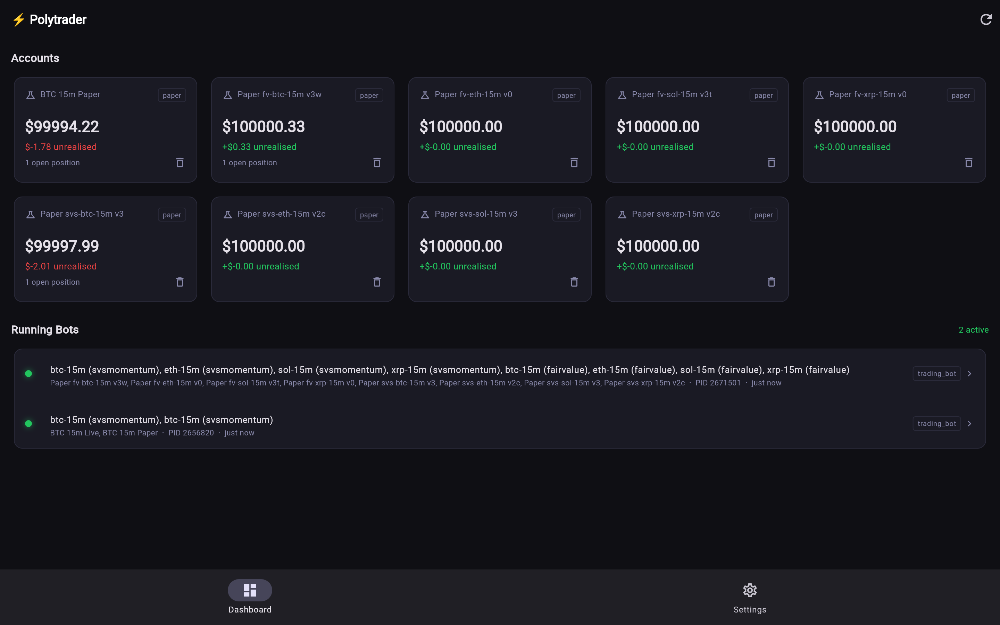
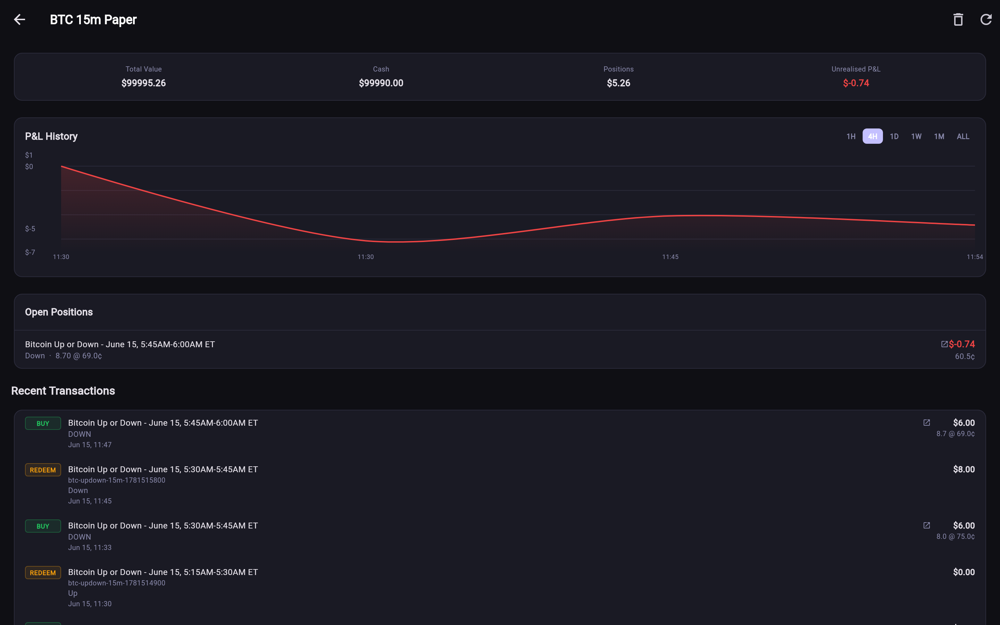
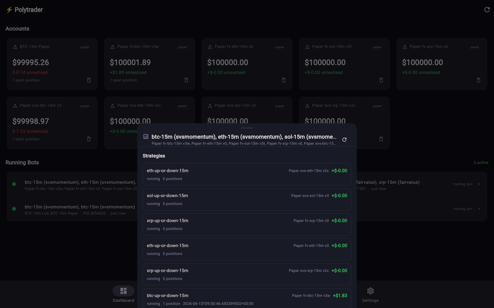
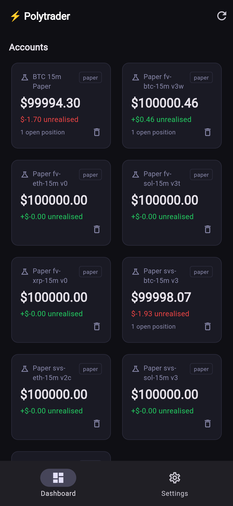
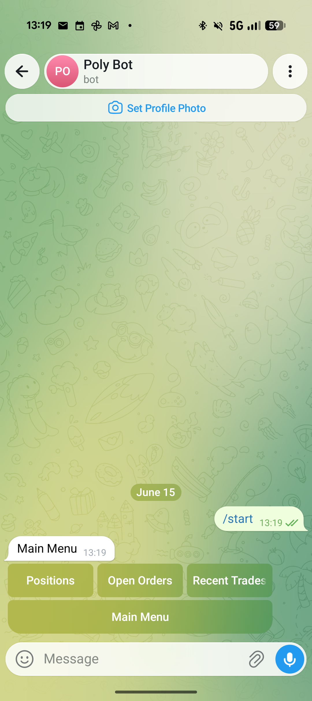
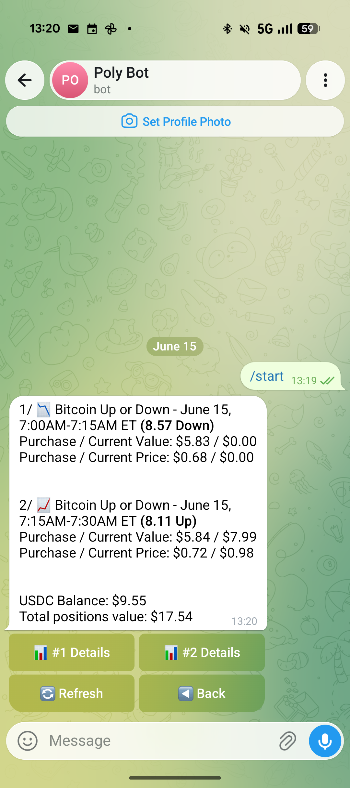
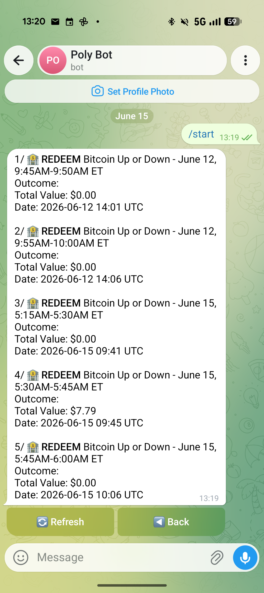
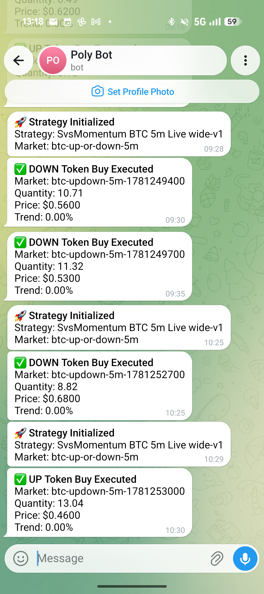

<div align="center">

# ⚡ Polytrader

### An automated, quant-grade trading framework for short-horizon crypto prediction markets

*Built in Rust · Battle-tested live on BTC / ETH / SOL / XRP up-or-down series · Proposed to migrate fully to your exchange*

</div>

---

## In one paragraph

**Polytrader** is a complete, production trading framework for crypto **"up-or-down"** prediction
markets (5-minute, 15-minute, hourly): live market-data gathering, signal computation, paper and live
execution, shared risk machinery, a deterministic record→replay backtester, a parameter optimizer, and
a web + mobile + Telegram control panel. It has been **running live with real capital for months** — today
against Polymarket, as a private, closed-source system that Polymarket does not sponsor, support, or
endorse in any way.

**What I'm asking you to fund:** porting this framework to a new exchange and dedicating it there —
open-sourced as public builder tooling, and operated as a hosted multi-tenant service so other API
traders can run bots on without rebuilding this stack. The live system is the proof that the
infrastructure works; the grant deliverable is the public good on top of it.

**Why it fits.** The framework was purpose-built for exactly the product line that defines a modern
crypto prediction market: continuous short-horizon up-or-down markets on an order book, reachable over
a REST + WebSocket API. Wherever that shape exists, the mapping is close to one-for-one — the
strategies, the signals, the risk layer, and the replay harness all carry over unchanged. Most
prediction-market ecosystems have no comparable open framework today.

---

## What the exchange gets

- 📈 **Continuous automated flow, around the clock.** Nine strategy books already run 24/7 across four
  assets and both pricing models. Pointed at your venue, that is signal-driven volume on the
  short-horizon crypto series every hour, not just during human trading hours.
- 💧 **Maker liquidity, not just taker volume.** The execution layer places priced limit orders with
  built-in expiry, which is exactly the behaviour maker-rebate and LP-reward programs are designed to
  attract. Automated books quote consistently on both sides of short-horizon markets, tightening books
  on the newest slots — the ones that are thinnest at open.
- 🤝 **A funnel for API traders.** The single biggest barrier to a quant trading a new venue is the six
  months of undifferentiated infrastructure — feeds, execution, accounting, backtesting — before the
  first strategy can be evaluated. Shipping that as open tooling plus a hosted service means an API
  trader can go from "curious about this venue" to a live, backtested bot in days. **Every trader
  onboarded this way is recurring liquidity and recurring volume.**
- 🧰 **A maintained public framework** carrying your API as a first-class integration, with docs and
  example strategies — a reference implementation you can point new builders at.
- 🔬 **Real usage data.** The recording pipeline captures full order books tick-by-tick; a replayable
  history of your own market microstructure is useful to you as well as to traders.

---

## See it running

> Real captures from the live control panel: nine running strategy *books* (instances of the eight
> implemented strategies) across **all four assets and both pricing models**, plus a **live funded
> account** trading alongside paper books.
>
> *These screenshots are from the current Polymarket deployment — the working proof that the framework
> is real and in production. Under this grant, the same panels get pointed at your markets.*


*Every strategy book at a glance: live balances, unrealised P&L, open positions, and running-bot health.*

| Account detail | Multi-asset strategy monitor |
|---|---|
|  |  |
| P&L history chart, open positions, and a full transaction log (buys / redemptions), here on a live BTC 15m book. | One bot orchestrating BTC/ETH/SOL/XRP across two strategies, with per-strategy live P&L. |

| Mobile app |
|---|
|  |
| Ships as a mobile app, monitor every book from anywhere. |

---

## The framework

Polytrader is built in layers. A strategy is just the thin signal layer on top; everything below
it is shared, tested infrastructure that every strategy reuses. **Only the bottom layer is venue-specific**,
which is what makes the migration a port rather than a rewrite.

### 📡 Live market-data gathering
A unified data layer continuously collects and caches everything a strategy needs in real time:
live order books, crypto spot prices, recent price history, and each event's strike, all behind
one clean interface, so strategies never deal with raw feeds. On a new venue this becomes that venue's
REST + WebSocket feed (price, orderbook, position and market-lifecycle events) behind the same
interface — nothing above it changes.

### 🧮 Trading-signal calculation
Strategies turn that data into entry/exit signals: fair-value option pricing, price-vs-strike
momentum, order-book imbalance, arbitrage edges, and more. The layer is **strategy-agnostic** and
its signals are derived purely from market data, so they behave identically live and in replay —
and identically across venues. *(Eight strategies are implemented today; adding another is a focused,
isolated change.)*

### ⚙️ Paper & live execution
One execution path runs against either a **paper account** or a **live funded account**; same code,
same accounting, chosen by a single config switch. Live orders carry a built-in expiry so a crashed
bot leaves nothing dangling, and settled positions are redeemed automatically. Against an order book
this is limit-order-native — the venue-facing adapter is the piece the grant replaces with your API.

### 🛡️ Shared core components
Reused across every strategy: **stop-loss** and **adaptive trailing stops**, risk-based position
sizing, automatic recovery from data/connectivity hiccups, and order-placement guardrails (e.g. a
NaN-price guard, an exchange-minimum size clamp, a circuit breaker) that block malformed or
too-small orders before they reach the market. This is the layer that makes it safe to let strangers
run bots on a hosted service.

---

## Telegram bot: monitor *and* manage from your phone

Telegram is a full **interactive control surface**, not just a notification feed. A `/start` menu
exposes inline commands to query live state on demand, and every running strategy pushes real-time
alerts as it acts, so an operator can supervise a fleet of bots entirely from chat.

**Query & manage**: `/positions`, `/orders`, `/trades` (and the menu buttons) return live data
with **inline navigation**: per-position **Details**, a **Refresh** button that re-pulls the latest
state in place, and **Back**. Positions show purchase vs. current value and price, USDC balance,
and total exposure; trades show buys, sells, and on-chain **redemptions** with outcomes and dates.

**Live alerts**: each strategy streams `🚀 init`, `✅ buy/sell executed` (with quantity, price,
trend), redemptions, and `🚨 termination` events as they happen, tagged by strategy and market.

| Command menu | Live positions | Trades & redemptions | Real-time alerts |
|---|---|---|---|
|  |  |  |  |

---

## Recording, replay & optimization

This is the backbone that makes the framework trustworthy — and the part an incoming API trader
cannot easily build for themselves.

- **Recording.** While trading live, every market tick is captured to a compact recording: full
  order books, spot prices, recent price history, timing, strike, and the strategy's own decisions.
  Recordings roll over automatically and survive data outages, building a growing, replayable
  history of real market conditions.

- **Replay.** Recorded sessions are replayed **tick-for-tick** through the *exact same code path*
  the live engine uses. There is no separate backtest code, so a strategy cannot behave differently
  in test than in production; the single biggest source of backtest/live divergence is eliminated
  by design.

- **Optimization.** An optimizer automatically searches strategy parameters over recorded data, with:
  - **Overfitting resistance**: separate validation and test windows (and per-hour reporting), so a
    parameter set has to generalise, not just fit one period.
  - **Risk-adjusted objectives**: tune for risk-adjusted return and drawdown limits, not just raw profit.
  - **Raw speed**: strategy P&L is evaluated against an in-memory portfolio that runs about **8× faster
    than the database-backed path**, making large parameter sweeps practical.

Together these turn "I think this strategy works" into "this parameter set was validated on real
recorded market data and is the exact code now trading live."

---

## How it fits together

```
        ┌────────────────────────────────────────────────┐
        │  Control panel (web + mobile)  ·  Telegram bot  │   monitor & manage
        └───────────────────────┬────────────────────────┘
                                │
   ┌──────────────┬─────────────┴──────────────┬───────────────────┐
   │  Strategies  │   Recording · replay ·     │  Paper & live     │
   │  (signals)   │   optimization             │  execution        │
   └──────────────┴─────────────┬──────────────┴───────────────────┘
                                │
                 ┌──────────────┴─────────────────┐
                 │    Unified market-data layer   │   one feed →
                 │   live trading  OR  replay     │   same strategy code
                 └──────────────┬─────────────────┘
                                │
                    ┌───────────┴────────────┐
                    │  Venue adapter         │  ← the only venue-specific layer
                    │  (exchange API)        │     today: Polymarket
                    └───────────┬────────────┘
                                │
                 Your markets  +  real-time crypto prices
```

Two design choices carry the whole proposal: one market-data layer feeds the *same* strategy code
whether it's trading live or replaying history (what you research is exactly what you trade), and
everything above the venue adapter is venue-agnostic (so migrating is a port, not a rewrite).

---

## Roadmap: what a grant unlocks

Deliverables are ordered so the **migration and the public-good work come first**.

- **Milestone 1: Migrate to your exchange.** Implement the venue adapter (REST + WebSocket data, order
  placement and cancellation, position redemption, and any split/merge or settlement primitives) against
  your API and SDK, re-validate the eight existing strategies on freshly recorded data from your
  markets, and run the framework live with real capital. *What you get:* an experienced automated
  trader's full book of strategies quoting and trading on your short-horizon crypto series.
- **Milestone 2: Open the infrastructure.** Publish the data, execution, risk, and record/replay layers
  as open-source reusable tooling — your-venue-first, with documentation and example strategies.
  *What you get:* a maintained public framework, and a credible answer to "I'd like to run a bot here,
  where do I start?"
- **Milestone 3: Multi-tenant service.** Today each part of the platform manages a single account/bot at
  a time. The whole stack (dashboard, mobile and Telegram control, recording, and the optimization
  tooling) becomes a hosted, multi-tenant service so other traders can run, monitor, and optimize their
  own bots from one place, without operating any infrastructure. *What you get:* a direct onboarding
  funnel for API traders — each one adding maker liquidity and volume on your books.
- **Milestone 4: New market types.** Beyond crypto up/down, the same data → signal → execution → risk
  pipeline extends to your other markets, including multi-outcome and category markets, driven by
  external insight feeds (news, data, sentiment). *What you get:* automated flow beyond the crypto
  series.
- **Ongoing: Research and liquidity.** Deeper replay tooling and a larger optimization harness on top of
  a growing recorded history of your market microstructure — plus dedicated market-making books aimed
  at your maker-rebate and liquidity-reward programs.

*Use of funds and timeline:* the grant would be scoped to the milestones above; the specific amount,
tranches, and delivery dates are to be agreed with your team.

---

## Honest status

- The framework is **live, production infrastructure today, on Polymarket** — a private deployment, not
  open-source, and in no way affiliated with, supported by, or endorsed by Polymarket.
- Nothing runs on your venue yet. Milestone 1 is exactly that work, and it is a port of a proven
  system, not a greenfield build.
- The grant is what makes it worth **dedicating** this framework to your exchange — migrating it,
  opening it, and running it as ecosystem infrastructure rather than a private edge.

---

<div align="center">

**Polytrader** — bringing quant-desk infrastructure, and the traders who need it, to your exchange.

📧 FlorentG74@proton.me

</div>
